# Object Detection Saliency Maps

Based on [mmdetection](https://github.com/open-mmlab/mmdetection) framework. You need to install MMDetaction first, follow here: [get_started.md](https://github.com/open-mmlab/mmdetection/blob/master/docs/en/get_started.md)

An installation example (cuda 11.6):
```
conda create -n detX python=3.9
conda activate detX
pip install torch==1.12.1+cu116 torchvision==0.13.1+cu116 torchaudio==0.12.1 --extra-index-url https://download.pytorch.org/whl/cu116
pip install -v -e .
pip install mmcv-full==1.7.0 -f https://download.openmmlab.com/mmcv/dist/cu116/torch1.12/index.html
```

## Update

- [2023.01.17] I released the Grad-CAM visualization results based on the single-stage object detection method, [RetinaNet](./gradcam-retinanet.py).

- [2023.01.16] I released the Grad-CAM visualization results based on the two-stage object detection method, [Faster R-CNN](./gradcam-frcn-c4-proposal.py).

## 1. Grad-CAM

> Selvaraju, Ramprasaath R., et al. "Grad-CAM: Visual Explanations from Deep Networks via Gradient-Based Localization." International Journal of Computer Vision 128.2 (2020): 336-359.

Paper Url: [https://arxiv.org/abs/1610.02391](https://arxiv.org/abs/1610.02391)

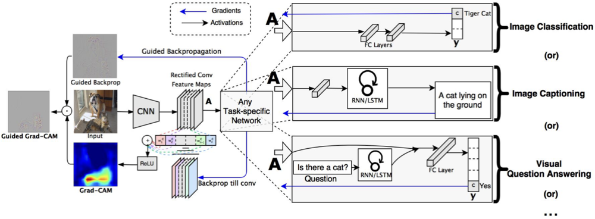

Supported Object Detection Algorithm:


<details>
<summary>Yolo V3</summary>

Paper: [https://arxiv.org/abs/1804.02767](https://arxiv.org/abs/1804.02767)

Step by step see: [gradcam-yolov3.ipynb](tutorial/gradcam-yolov3.ipynb)

Model config and checkpoint: [https://huggingface.co/RuoyuChen/objectdetection-saliency-maps/](https://huggingface.co/RuoyuChen/objectdetection-saliency-maps/)

```angular2html
python gradcam-yolov3.py \
        --config <Configs Path> \
        --checkpoint <Checkpoint Path> \
        --image-path <Your Image Path> \
        --bbox-index 0 \
        --save-dir images/GradCAM/YOLOV3
```

Visualization:

| 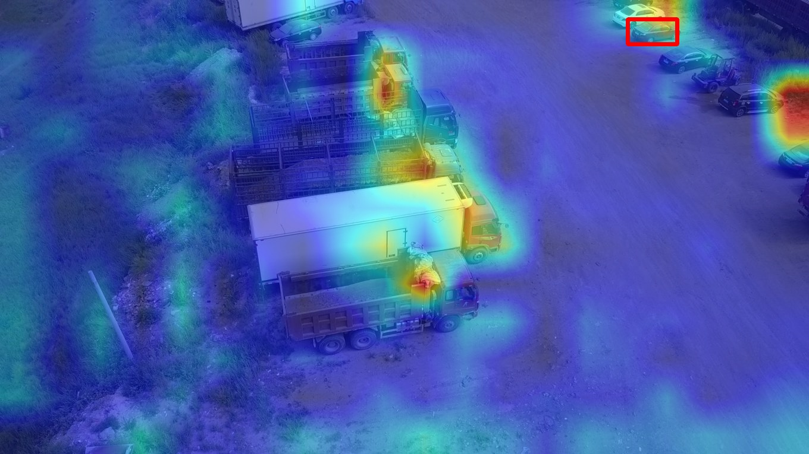  |  |  |
|  ----  | ----  | ----  |
|  | 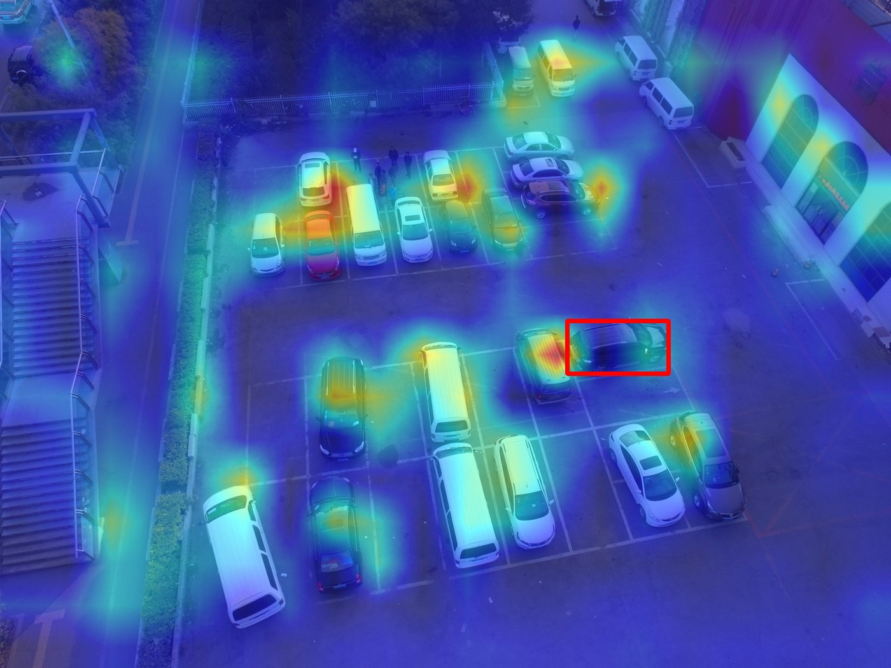 | 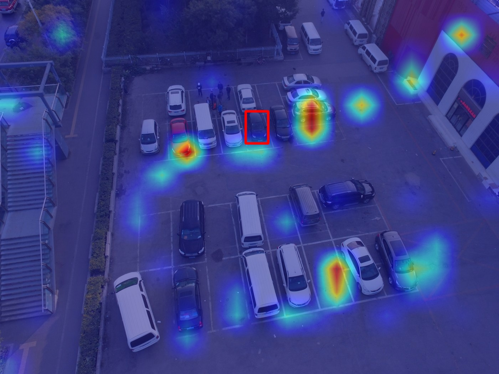 |


</details>

<details>
<summary>Faster R-CNN (C4)</summary>

Paper: [https://arxiv.org/abs/1506.01497](https://arxiv.org/abs/1506.01497)

Step by step see: [gradcam-faster-rcnn-C4-proposal.ipynb](tutorial/gradcam-faster-rcnn-C4-proposal.ipynb) and [gradcam-faster-rcnn-C4-global.ipynb](tutorial/gradcam-faster-rcnn-C4-global.ipynb)

```angular2html
mkdir checkpoints
cd checkpoints
wget https://download.openmmlab.com/mmdetection/v2.0/faster_rcnn/faster_rcnn_r50_caffe_c4_1x_coco/faster_rcnn_r50_caffe_c4_1x_coco_20220316_150152-3f885b85.pth
cd ..
```

visualization based on proposal:

```shell
python gradcam-frcn-c4-proposal.py \
        --config <Configs Path> \
        --checkpoint <Checkpoint Path> \
        --image-path <Your Image Path> \
        --bbox-index 0 \
        --save-dir images/GradCAM/FRCN-C4
```

| | | |
|-|-|-|
|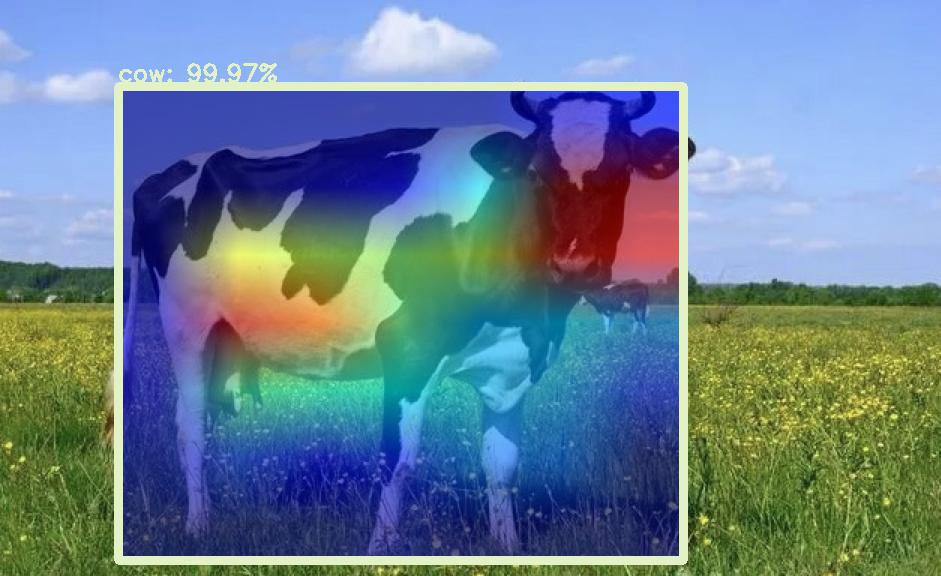|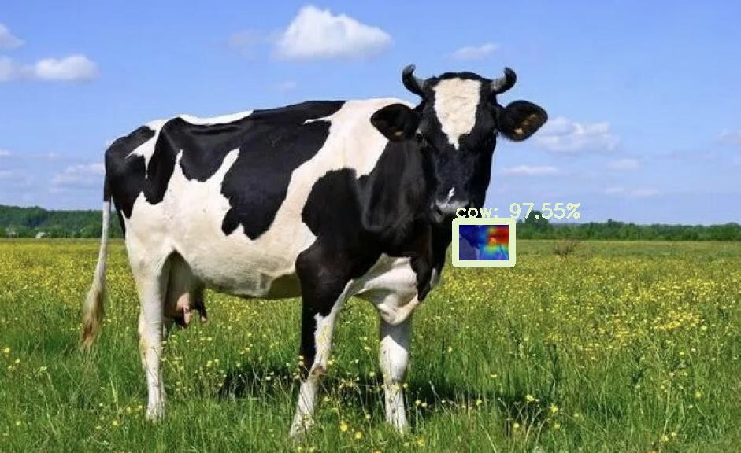|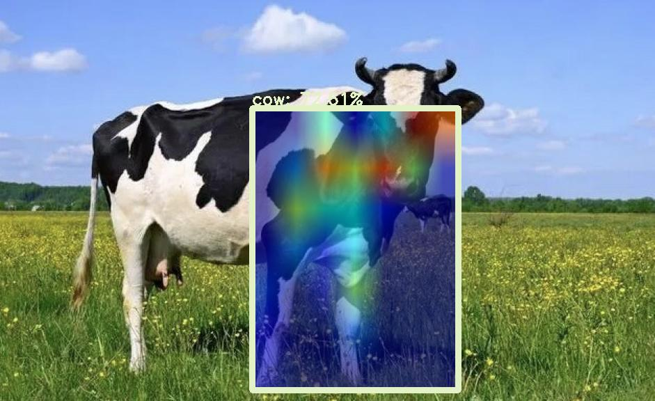|

visualization based on global:
```
python gradcam-frcn-c4-global.py \
        --config <Configs Path> \
        --checkpoint <Checkpoint Path> \
        --image-path <Your Image Path> \
        --bbox-index 0 \
        --save-dir images/GradCAM/FRCN-C4
```

| | | |
|-|-|-|
|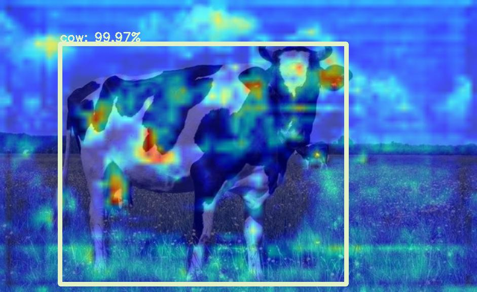|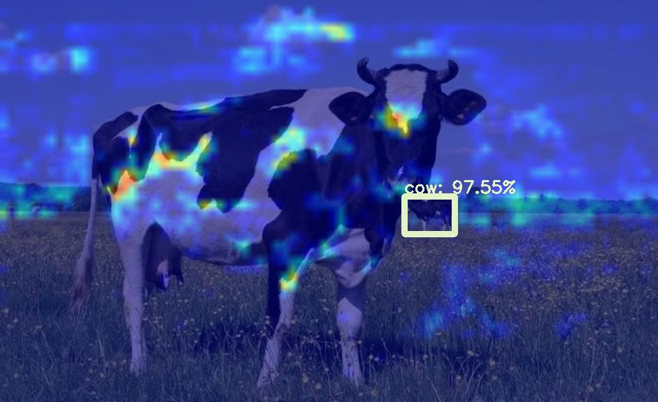|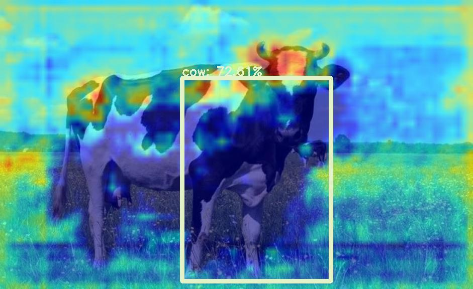|

</details>

<details>
<summary>RetinaNet</summary>

Paper: [https://arxiv.org/abs/1708.02002](https://arxiv.org/abs/1708.02002)

No step by step

```angular2html
wget https://download.openmmlab.com/mmdetection/v2.0/retinanet/retinanet_r50_fpn_1x_coco/retinanet_r50_fpn_1x_coco_20200130-c2398f9e.pth

python gradcam-retinanet.py \
        --config <Configs Path> \
        --checkpoint <Checkpoint Path> \
        --image-path <Your Image Path> \
        --bbox-index 0 \
        --save-dir images/GradCAM/RetinaNet
```

Visualization:

|  |  |  |
|  ----  | ----  | ----  |
| 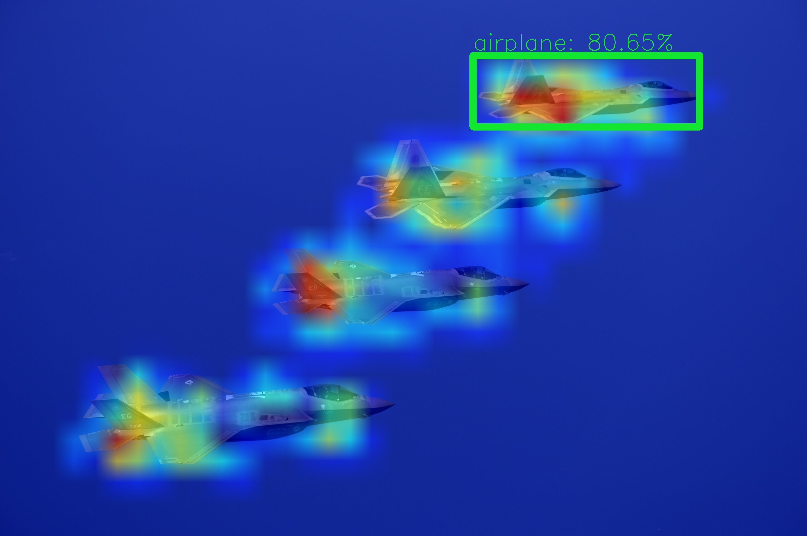 | 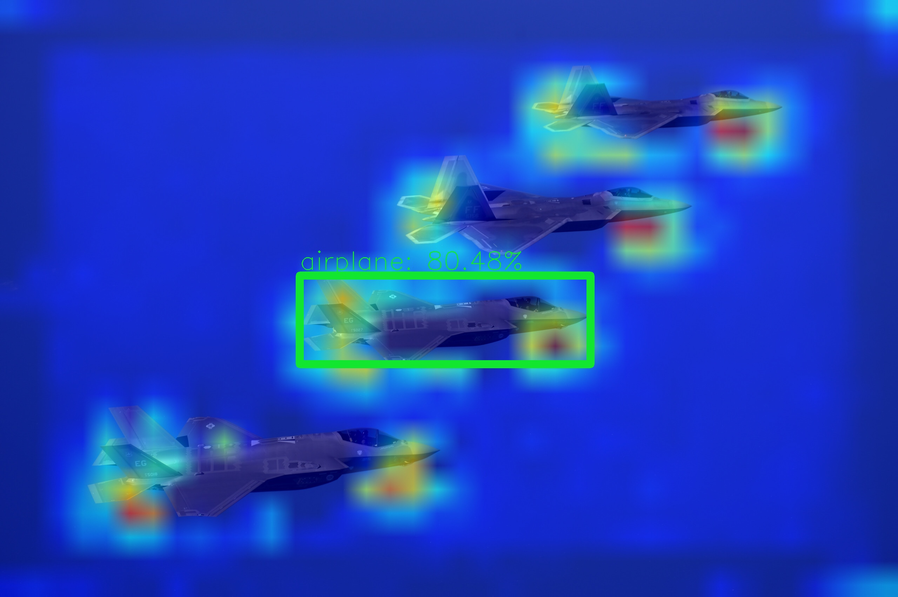 | 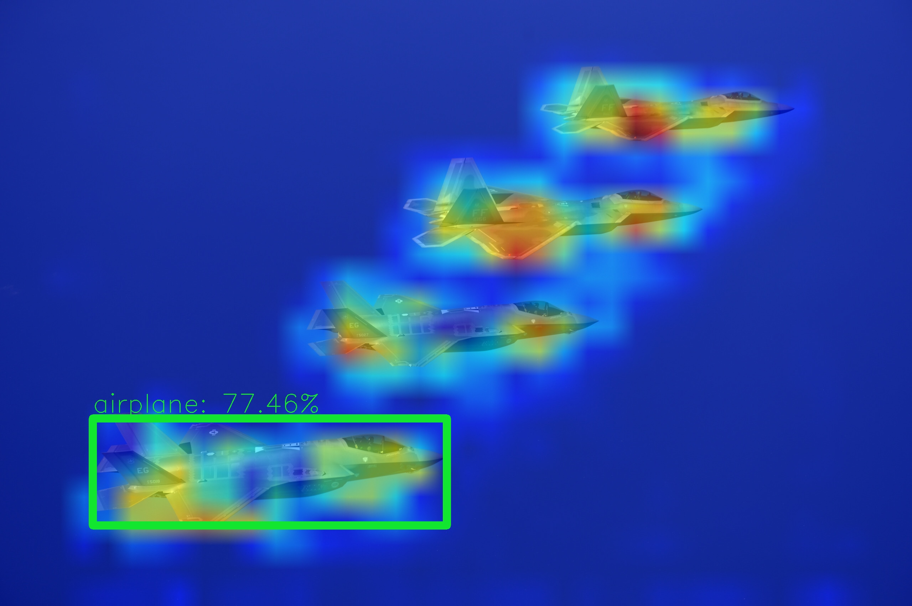 |


</details>


## 2. D-RISE

> Vitali Petsiuk, Rajiv Jain, Varun Manjunatha, Vlad I. Morariu, Ashutosh Mehra, Vicente Ordonez, Kate Saenko; Proceedings of the IEEE/CVF Conference on Computer Vision and Pattern Recognition (CVPR), 2021, pp. 11443-11452

Paper Url: [https://openaccess.thecvf.com/content/CVPR2021/html/Petsiuk_Black-Box_Explanation_of_Object_Detectors_via_Saliency_Maps_CVPR_2021_paper.html](https://openaccess.thecvf.com/content/CVPR2021/html/Petsiuk_Black-Box_Explanation_of_Object_Detectors_via_Saliency_Maps_CVPR_2021_paper.html)

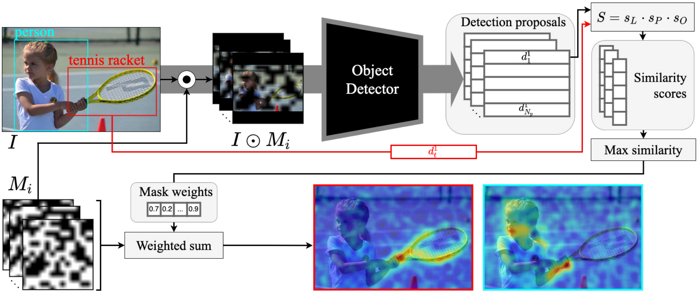

Supported Object Detection Algorithm:


<details>
<summary>Yolo V3</summary>

Paper: [https://arxiv.org/abs/1804.02767](https://arxiv.org/abs/1804.02767)

Step by step see: [drise-yolov3.ipynb](tutorial/drise-yolov3.ipynb)

Model config and checkpoint: [https://huggingface.co/RuoyuChen/objectdetection-saliency-maps/](https://huggingface.co/RuoyuChen/objectdetection-saliency-maps/)

```angular2html
python drise-yolov3.py \
        --config <Configs Path> \
        --checkpoint <Checkpoint Path> \
        --image-path <Your Image Path> \
        --bbox-index 0 \
        --save-dir images/DRISE/YOLOV3
```

Visualization:

| 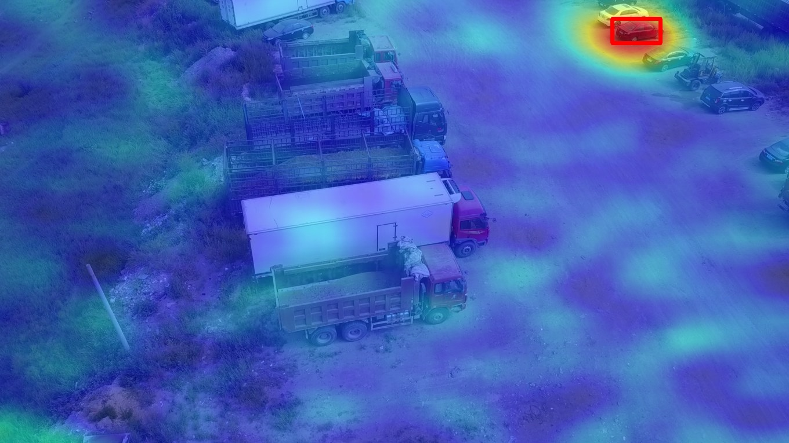  | 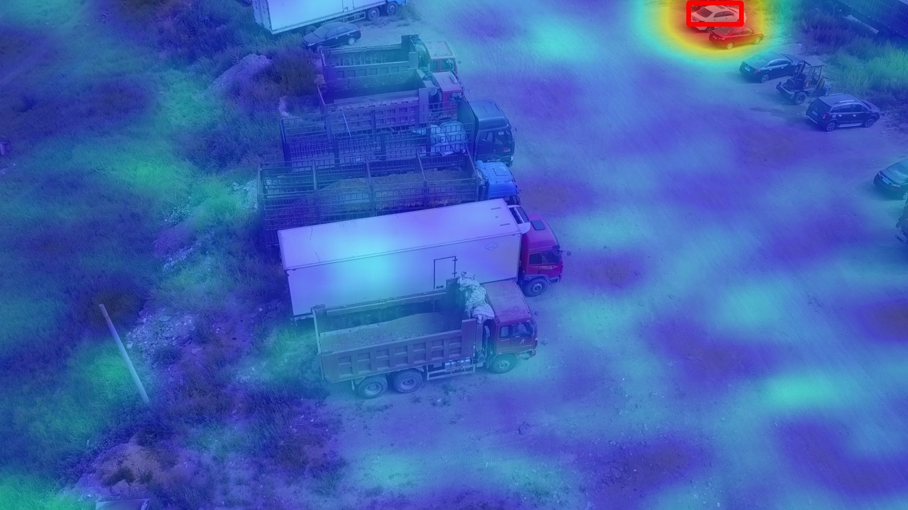 |  |
|  ----  | ----  | ----  |
| 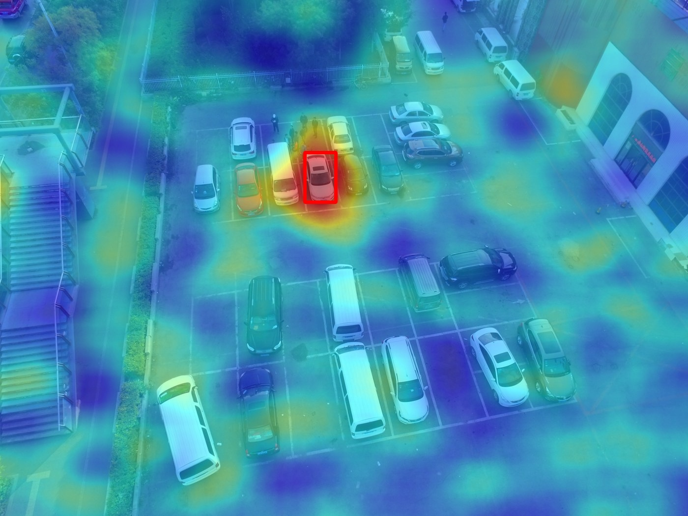 |  | 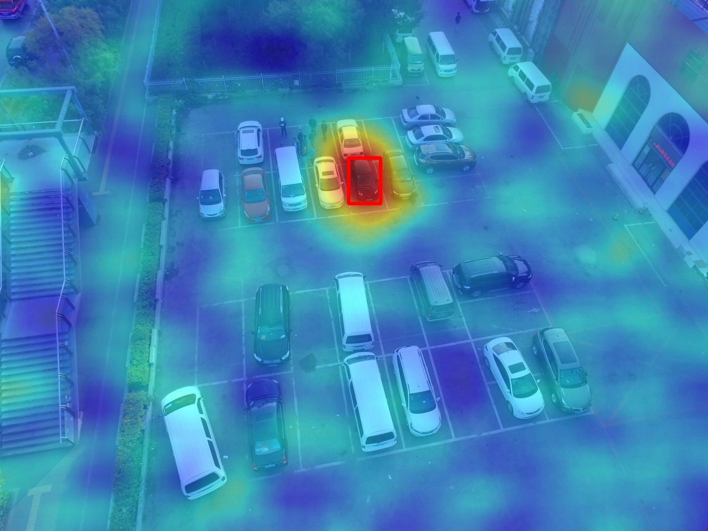 |


</details>