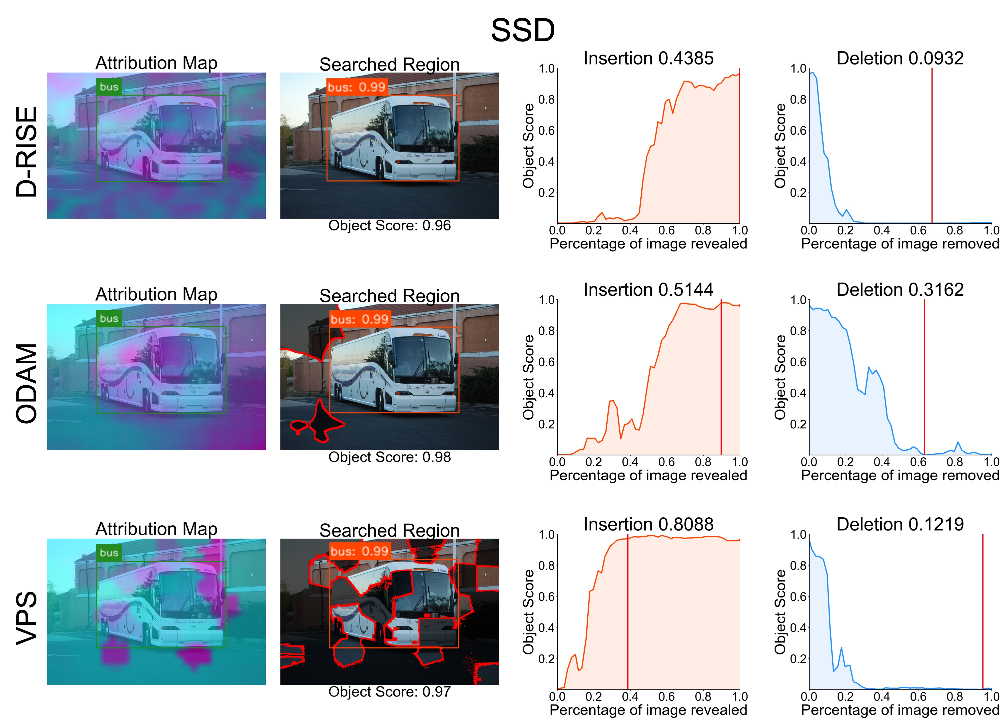

# Object Detection Saliency Maps

## 📰 News & Update

- [2024.12.31] We released a baseline for interpretable object detection methods based on mmdetetion version 3.0, supporting GradCAM, ODAM, and D-RISE algorithms. Please see [version3](./version3)

- [2024.11.25] Our paper [Interpreting Object-level Foundation Models via Visual Precision Search](https://arxiv.org/abs/2411.16198) is now visible on [https://arxiv.org/abs/2411.16198](https://arxiv.org/abs/2411.16198), and the code will be released at [https://github.com/RuoyuChen10/VPS](https://github.com/RuoyuChen10/VPS) after publish.

- [2023.01.17] We released a baseline for interpretable object detection methods based on mmdetetion version 3.0, supporting GradCAM, and D-RISE algorithms. Please see [version2.25.2](./version2.25.2)

## 😮 Highlights

We have conducted theoretical and experimental analyses demonstrating that VPS is a highly faithfulness interpretation method for explaining object-level model decision (object detection or visual grounding), applicable to both multimodal object-level foundation models and traditional target detection models. The paper is available at https://arxiv.org/abs/2411.16198, and the code will be released at https://github.com/RuoyuChen10/VPS following acceptance.

